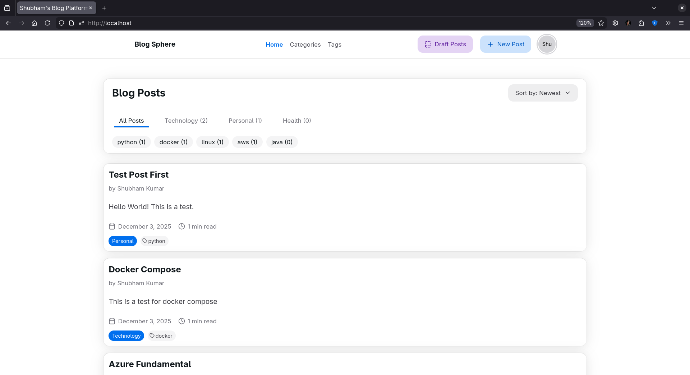
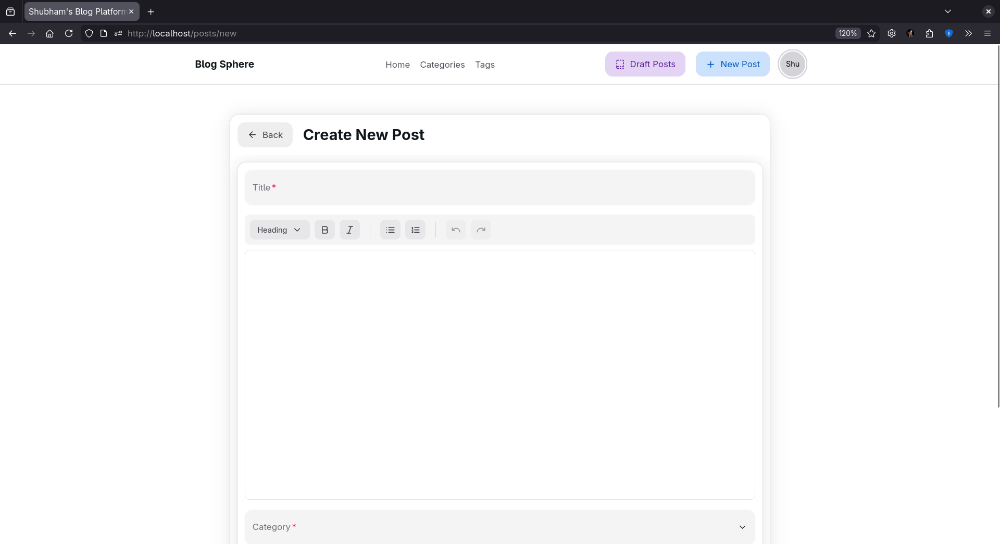
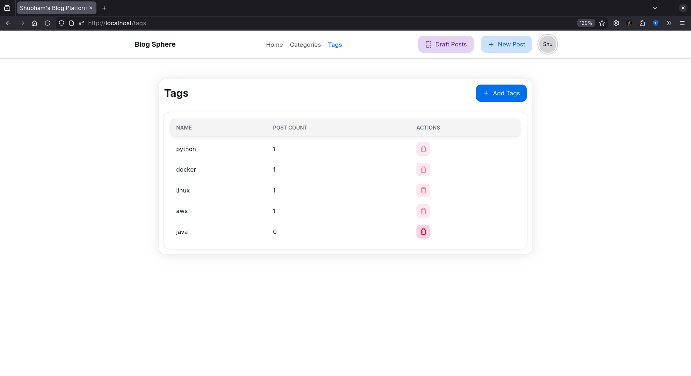
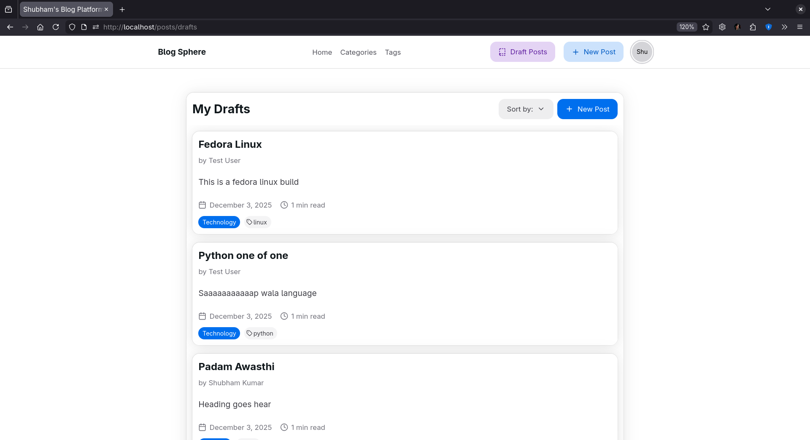

# Blogsphere: A Modern Full-Stack Blogging Platform

<div align="center">
  
  
  
  
  
  
  
</div>

<br>

<p align="center">
  <a href="#features">Features</a> •
  <a href="#tech-stack">Tech Stack</a> •
  <a href="#architecture">Architecture</a> •
  <a href="#getting-started">Getting Started</a> •
</p>

## Overview

Blogsphere is a feature-rich, full-stack blogging platform designed to provide a seamless and modern user experience for writers and readers. Built with a robust Java/Spring Boot backend and a dynamic React/TypeScript frontend, this project showcases a comprehensive understanding of modern web development principles, from RESTful API design to secure authentication and responsive UI/UX.







---

## Features

- **User Authentication:** Secure user registration and login using JWT (JSON Web Tokens).
- **CRUD Operations:** Full capabilities for creating, reading, updating, and deleting blog posts.
- **Rich Text Editor:** A modern editor for writing and formatting blog posts.
- **Categorization and Tagging:** Organize posts with categories and tags for easy discovery.
- **Post Management:** View and manage your own drafts and published posts.
- **Responsive Design:** A clean, responsive, and intuitive UI built with Tailwind CSS.
- **RESTful API:** A well-structured backend API for managing all application data.
- **Containerized Deployment:** Fully containerized with Docker for consistent development and deployment environments.

---

## Tech Stack

### Backend

| Technology          | Description                                                    |
| :------------------ | :------------------------------------------------------------- |
| **Java 25**         | Core programming language for the backend.                     |
| **Spring Boot**     | Framework for building the robust and scalable REST API.       |
| **Spring Security** | For implementing JWT-based authentication and authorization.   |
| **Spring Data JPA** | For data persistence and interaction with the database.        |
| **PostgreSQL**      | The relational database used for storing all application data. |
| **Maven**           | For project build and dependency management.                   |

### Frontend

| Technology       | Description                                                                |
| :--------------- | :------------------------------------------------------------------------- |
| **React**        | Core library for building the user interface.                              |
| **TypeScript**   | For type-safe and more maintainable code.                                  |
| **Vite**         | Modern frontend build tool for a fast development experience.              |
| **Tailwind CSS** | A utility-first CSS framework for creating a responsive and modern design. |
| **React Router** | For client-side routing and navigation.                                    |
| **Axios**        | For making HTTP requests to the backend API.                               |

### DevOps

| Technology         | Description                                                     |
| :----------------- | :-------------------------------------------------------------- |
| **Docker**         | For containerizing both the frontend and backend applications.  |
| **Docker Compose** | For defining and running the multi-container application stack. |

---

## Architecture

Blogsphere is built on a classic client-server architecture:

- **Backend (Blogsphere API):** A monolithic Spring Boot application that exposes a set of RESTful endpoints. It handles all business logic, data processing, and interaction with the PostgreSQL database. Security is managed by Spring Security, which validates JWTs on protected routes.
- **Frontend (Blogsphere UI):** A single-page application (SPA) built with React. It communicates with the backend API via HTTP requests (using Axios) to fetch and display data, as well as to handle user actions. The UI is designed to be completely decoupled from the backend.
- **Database:** A PostgreSQL database stores all user data, posts, tags, and categories.

This separation of concerns allows for independent development, scaling, and deployment of the frontend and backend services.

---

## Getting Started

To get a local copy up and running, follow these simple steps.

### Prerequisites

- Java 25 (or change in pom.xml to use 21 or 17)
- Node.js and npm
- Docker and Docker Compose

### Installation & Setup

1.  **Clone the repository:**

    ```sh
    git clone git@github.com:shubhamk099/blogsphere-platform.git
    cd blogsphere-platform
    ```

2.  **Run the application using Docker Compose:**
    This is the simplest way to get the entire stack (backend, frontend, and database) running.

    ```sh
    docker-compose up --build
    ```

3.  **Access the application:**
    - The frontend will be available at [http://localhost:80](http://localhost:5173)
    - The backend API will be available at [http://localhost:8080](http://localhost:8080)

### Manual Setup (Without Docker)

If you prefer to run the services manually:

**Backend (Blogsphere API):**

```sh
cd blogsphere
# You may need to configure the database connection in src/main/resources/application.properties
mvn spring-boot:run
```

**Frontend (Blogsphere UI):**

```sh
cd blogsphere-ui
npm install
npm run dev
```

NOTE : You need to run your your postgres container in this case for database.

---
